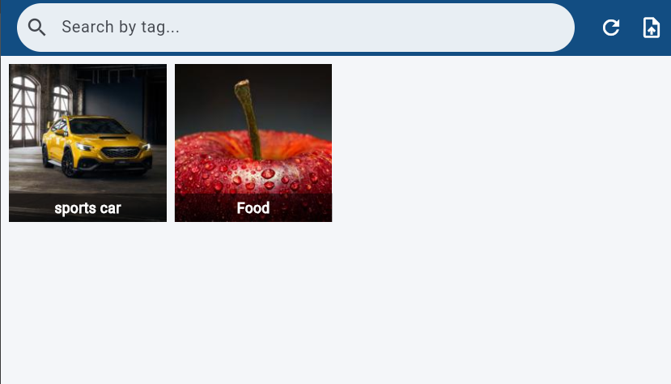
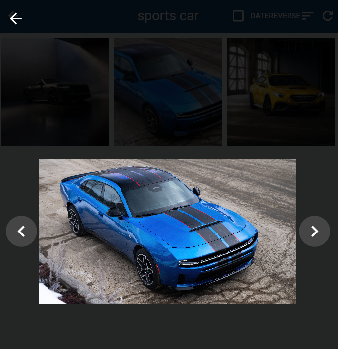
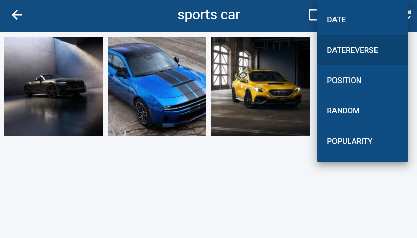
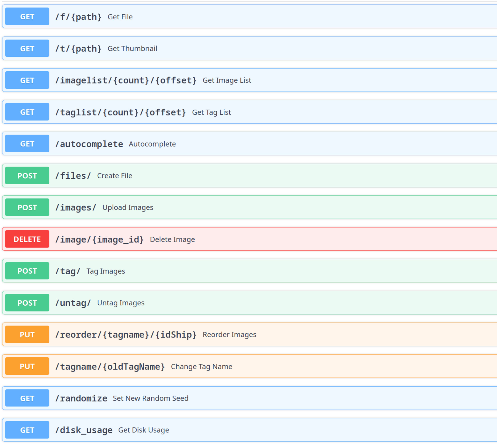

# 📸 Photo Gallery App (Full-Stack)

A modern, high-performance image gallery application built with a scalable **FastAPI** backend and a robust **Flutter** mobile frontend. This project features a robust tag management system, infinite scrolling, and efficient image storage.

---

## 🖼️ Screenshots

<p align="center">
  
  
  
  
</p>

---

## 🛠️ Tech Stack

### Backend

- **Framework:** [FastAPI](https://fastapi.tiangolo.com/) (Python 3.10+)
- **Database:** [MySQL](https://www.mysql.com/) (via Laragon/XAMPP)
- **Libraries:** `fastapi`, `python-multipart`, `aiofiles`, `mysql-connector-python`, `python-dotenv`, `Pillow`, `requests`, `pytest`
- **Processing:** [Pillow](https://python-pillow.org/) for image compression and thumbnails.

### Frontend

- **Framework:** [Flutter 3.x](https://flutter.dev/) (Null Safety)
- **State Management:** [Riverpod 2.x](https://riverpod.dev/)
- **Widgets Used:** `Scaffold`, `AppBar`, `IconButton`, `Icon`, `Text`, `Image`, `ListView`, `GridView` (`SliverGrid`), `GestureDetector`, `CircularProgressIndicator`, `MaterialPageRoute`, `CachedNetworkImage`. (Custom Widgets: `TagSearchBar`, `TiledGridView`)
- **Libraries:** `cupertino_icons`, `flutter_riverpod`, `dio`, `http`, `file_picker`, `photo_view`, `panorama_viewer`, `flutter_typeahead`, `cached_network_image`.
- **Networking:** [Dio](https://pub.dev/packages/dio) & [HTTP](https://pub.dev/packages/http)

---

## 📁 Project Structure

```text
photo-gallery-app/
├── backend/            # FastAPI Source Code
│   ├── app/           # Application Logic
│   ├── files/         # Image & Thumbnail storage
│   └── .env           # Configuration (Database, etc)
├── frontend/           # Modern Flutter Frontend (Riverpod)
└── init.sql            # Database Schema
```

---

## 🚀 Getting Started

### 1. Database Setup (MySQL)

1.  Ensure your MySQL server (via Laragon/XAMPP) is running.
2.  Import the database schema using your preferred terminal from the project root. It will create a database named `images` and set up the required tables & procedures.

    **Command Prompt (CMD) & Bash:**
    ```bash
    mysql -u root -p < init.sql
    ```

    **PowerShell:**
    ```powershell
    Get-Content init.sql | mysql -u root -p
    ```

    *(Alternatively, you can log into the MySQL client console and type `source init.sql`)*

### 2. Backend Setup (FastAPI)

1.  Navigate to the `backend` directory:
    ```bash
    cd backend
    ```
2.  Create and activate a virtual environment:
    ```bash
    python -m venv venv
    .\venv\Scripts\activate  # Windows
    ```
3.  Install dependencies:
    ```bash
    pip install -r requirements.txt
    pip install uvicorn psutil  # Additional requirements
    ```
4.  Configure `.env` file:
    ```env
    DB_PASSWORD=your_mysql_password
    ```
5.  Run the server:
    ```bash
    python -m uvicorn app.main:app --reload
    ```
    _Server will be live at `http://127.0.0.1:8000`_

### 3. Frontend Setup (Flutter)

1.  Navigate to the `frontend` directory:
    ```bash
    cd frontend
    ```
2.  Install dependencies:
    ```bash
    flutter pub get
    ```
3.  Configure Backend IP:
    Open `lib/core/backend_config.dart` and ensure `baseUrl` is correct:
    - **Emulator Android:** Gunakan `http://10.0.2.2:8000`
    - **Ke Perangkat Asli / Web:** Gunakan IP Local komputer (misal: `http://192.168.1.5:8000`) atau `http://localhost:8000` untuk browser lokal.

4.  **Run the application (Mobile / Emulator):**

    ```bash
    flutter run
    ```

    _(Gunakan tombol `r` di terminal untuk Hot Reload)_

5.  **Run the application (Web / Chrome):**
    ```bash
    flutter run -d chrome
    ```
    _(Catatan keamanan web: Jika backend Anda mencegah akses, pastikan Anda telah mengatur Middleware CORS di FastAPI)_

---

## 📖 Cara Penggunaan Dasar

1.  **Melihat Galeri:** Saat pertama kali masuk, Anda akan melihat beranda berisikan foto (Tiled Grid). Anda bisa men-_scroll_ ke bawah secara infinit (otomatis memuat foto selanjutnya).
2.  **Membuka Foto Detail:** Ketuk/Klik gambar mana saja dari grid untuk membuka penampil gambar ukuran penuh. Di sini Anda bisa men-_zoom_ (cubit layar/scroll) atau _pan_ gambar tersebut.
3.  **Pencarian Berdasarkan Tag:** Di bagian atas (_AppBar_), gunakan kotak teks untuk mencari gambar berdasarkan kategori `Tag`. Cukup ketik nama tag (contoh: "pemandangan") dan pilih dari saran pencarian.
4.  **Mengunggah Foto Baru:** Ketuk ikon **Upload** (📤) di pojok kanan atas untuk membuka halaman _Upload_. Pilih foto dari galeri/penyimpanan perangkat Anda, lalu tekan unggah ke server lokal.
5.  **Memuat Ulang Data:** Jika terjadi perubahan atau foto baru belum muncul, klik ikon **Refresh** (🔄) di pojok kanan atas layar beranda.

---

## ✨ Key Features

- **Smart Gallery:** Automatic thumbnail generation for faster loading.
- **Tag System:** Group and search images using a dynamic tag mapping system.
- **Infinite Scroll:** Smoothly browse through thousands of images with paginated fetching.
- **Universal Upload:** Support for multiple image uploads with optional compression.
- **360° Viewer:** Built-in Panorama support for immersive image viewing.
- **Modern State:** Scalable architecture using Riverpod for predictable UI updates.

---

## 📝 API Endpoints

You can explore the interactive API documentation at:

- [http://127.0.0.1:8000/docs](http://127.0.0.1:8000/docs) (Swagger UI)

---

## ⚖️ License

This project is open-source. Feel free to use and modify it for your own learning or projects.
